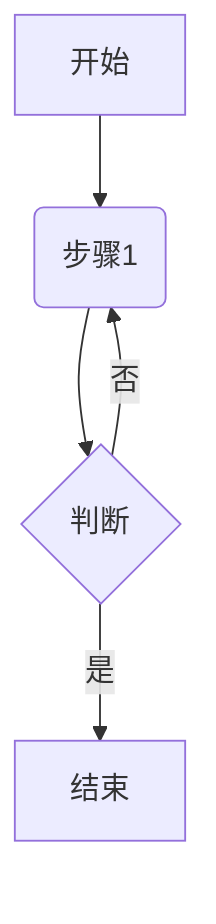

源代码模式

# 使用手册

## 基本语法

### 2.1标题

#加空格 一级标题

##加空格 二级标题

###加空格 三级标题

### 2.2文本格式

加粗：** 加粗 **  （去掉空格）     **加粗**

斜体：* 斜体 *（去掉空格）   *斜体*--

斜体加粗：文字左右两边均是三个型号      ***斜体加粗***

删除线：~~ 删除线 ~~     ~~删除线~~

分割线：三个连续减号 --- 或者三个星号***

---

***

行内代码:  `行内代码（与左边的符号相同）

  `System.out.println("Hello!") `

引用块： >加空格

> 你好世界

### 2.3 列表

无序列表  -加空格

- 早餐
- 中餐

有序列表 1.加空格

1. 早餐
2. 中餐

任务列表（未完成）： - [ ]加空格

- [ ] 晚餐

任务列表（已完成）：- [x]加空格

- [x] 早餐
- [ ] 中餐（点一下方框可使已完成，未完成相互转换）

### 2.4链接与图片

链接文字：[链接文字] （URL路径）

链接图片：！[图片名字]（图片地址）

！[前壁纸](C:\Users\littlestart\Pictures\Screenshots)

快捷方式：直接拖拽图片到 Typora 会自动插入

### 2.5表格

| 列1                    | 列2      | 列3      |
| ---------------------- | -------- | -------- |
| content1               | content2 | content3 |
| 快捷方式：右键插入表格 |          |          |
### 2.6代码块
···java
System.out.println("Hello, World!")···
支持编程语言高亮
### 2.7数学公式
- 行内公式($)：$E=mc^s$
- 块级公式（
）：
）
：

\int_a^b f(x)dx
$$
## 高级功能
### 3.1 目录（TOC）
输入[toc(要大写)]自动生成目录
### 脚注
脚注 [ ^note]:(注意不能有空格)
[^note]: 来自Deepseek
### 3.3 图表（支持绘制 流程图、时序图、甘特图 等）

！[tubiao](C:\Users\littlestart\Pictures\Screenshots\tubiao.png)
### 导出文件
支持导出为
PDF（推荐，格式最稳定）
HTML
Word (.docx)
图片 (.png/.jpg)
方法：文件 → 导出
### 快捷键（仅window系统）
加粗：ctrl + b  斜体：ctrl + i  插入链接： ctrl + k   插入图片：ctrl+shift+i
表格 ctrl + t  代码块：ctrl+shift+K   搜索：ctrl+f  替换：ctrl+h

退出源代码模式后

使用手册
基本语法
2.1标题
#加空格 一级标题

##加空格 二级标题

###加空格 三级标题

2.2文本格式
加粗：** 加粗 ** （去掉空格） 加粗

斜体：* 斜体 *（去掉空格） 斜体--

斜体加粗：文字左右两边均是三个型号 斜体加粗

删除线：~~ 删除线 ~~ 删除线

分割线：三个连续减号 --- 或者三个星号***

行内代码: `行内代码（与左边的符号相同）

System.out.println("Hello!")

引用块： >加空格

你好世界

2.3 列表
无序列表 -加空格

早餐

中餐

有序列表 1.加空格

早餐

中餐

任务列表（未完成）： - [ ]加空格

晚餐
任务列表（已完成）：- [x]加空格

早餐
中餐（点一下方框可使已完成，未完成相互转换）
2.4链接与图片
链接文字：[链接文字] （URL路径）

链接图片：！[图片名字]（图片地址）

！前壁纸

快捷方式：直接拖拽图片到 Typora 会自动插入

2.5表格
列1	列2	列3
content1	content2	content3
快捷方式：右键插入表格		
2.6代码块
···java System.out.println("Hello, World!")··· 支持编程语言高亮

2.7数学公式
行内公式($)：$E=mc^s$

块级公式（$$）：

∫baf(x)dx
∫
𝑎
𝑏
𝑓
(
𝑥
)
𝑑
𝑥

高级功能
3.1 目录（TOC）
输入[toc(要大写)]自动生成目录

脚注
脚注 [ ^note]:(注意不能有空格)

[note]  来自Deepseek

3.3 图表（支持绘制 流程图、时序图、甘特图 等）
是

否

开始

步骤1

判断

结束

！tubiao

导出文件
支持导出为 PDF（推荐，格式最稳定） HTML Word (.docx) 图片 (.png/.jpg) 方法：文件 → 导出

快捷键（仅window系统）
加粗：ctrl + b 斜体：ctrl + i 插入链接： ctrl + k 插入图片：ctrl+shift+i 表格 ctrl + t 代码块：ctrl+shift+K 搜索：ctrl+f 替换：ctrl+h
————————————————

                            版权声明：本文为博主原创文章，遵循 CC 4.0 BY-SA 版权协议，转载请附上原文出处链接和本声明。

原文链接：https://blog.csdn.net/little_starts/article/details/147773587